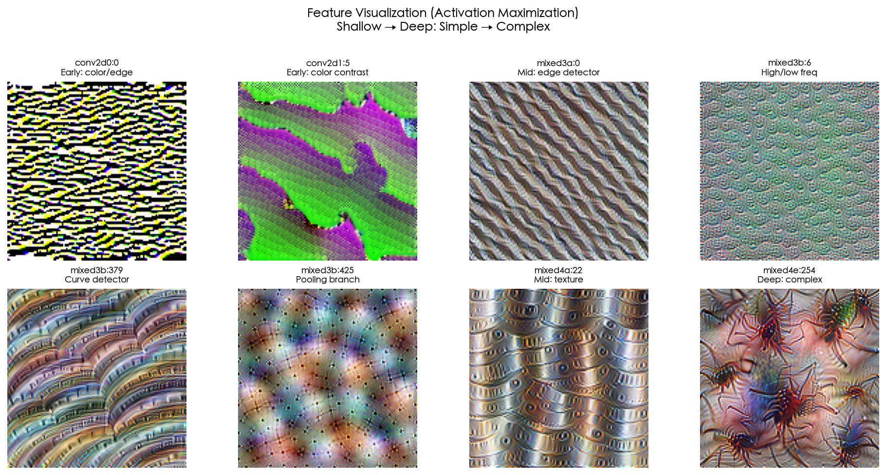
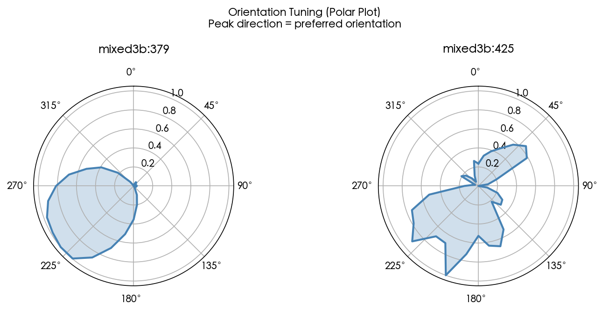
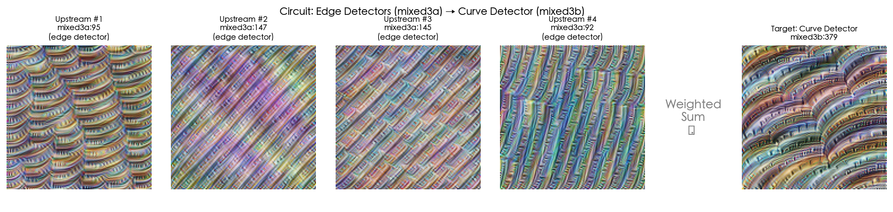
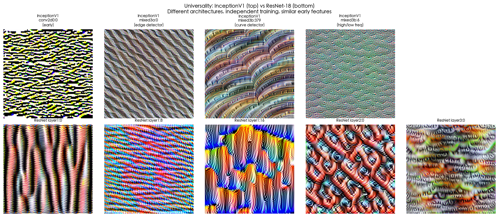

# Circuits: Zoom In — 动手教程

[**English README**](README.md) ·
[](https://colab.research.google.com/github/Jonny-English/circuits-zoom-in/blob/main/notebooks/circuits_zoom_in_zh.ipynb)
[](LICENSE)
[](https://www.python.org/downloads/)

---

> *"如果你足够仔细地观察，你会发现每一个神经元都在试图告诉你一些东西。"*
> — Chris Olah

<p align="center">
  
  &nbsp;&nbsp;
  
</p>
<p align="center">
  <em>左：8 个神经元的"理想图案"——从随机噪声中优化而来，每一张都是一个神经元对世界的理解。</em><br/>
  <em>右：曲线探测器的方向偏好——像指南针一样，每个神经元都有它最钟情的方向。</em>
</p>

<p align="center">
  
  &nbsp;&nbsp;
  
</p>
<p align="center">
  <em>左：一个完整的"电路"——四个边缘探测器加权求和，计算出一个曲线探测器。神经网络的推理不是黑箱，是可以被追踪的。</em><br/>
  <em>右：两个完全不同的模型（InceptionV1 vs ResNet-18），独立训练，却不约而同地学会了相似的视觉"词汇"。</em>
</p>

---

## 项目概览

2020 年，Chris Olah 和他在 OpenAI 的同事们发表了一篇改变了许多人对神经网络认知的论文。论文的核心论点朴素得令人意外：如果你足够仔细地观察视觉模型内部的权重和激活值，你会发现单个神经元在检测有意义的特征，这些神经元通过权重连接形成可解释的电路，而且相同的特征和电路会在完全不同的架构中反复出现。他们把这篇论文叫做《[Zoom In: An Introduction to Circuits](https://distill.pub/2020/circuits/zoom-in/)》。

这个仓库是我从零开始复现那些核心实验的尝试，并且刻意用中文来写——每一个变量都用中文命名，每一段解释都先用中文写成。这不是为了标新立异。当你读到 `shape_record` 的时候，你的眼睛可能会把它当作一个熟悉的编程符号滑过去，而不去思考它到底代表什么。但当你读到 `形状记录` 的时候，你不得不停下来想一想：这个东西记录的是什么形状，为什么要记录它。中文变量名是一种教学手段——它让你在恰当的地方慢下来。

## 实验与收获

Notebook 按顺序走过六个实验，每一个都建立在前一个的基础上。当你走完全程，你将亲手触碰到机械可解释性的基岩——不是通过阅读别人的结论，而是通过自己运行每一行代码、凝视每一张图片、验证每一个假设。

| 实验 | 你将看到什么 |
|------|------------|
| **§2 特征可视化** | 从随机噪声出发，用梯度上升让神经元的激活最大化——向它提问：*你在找什么？* 答案往往是清晰可辨的曲线、边缘和纹理。 |
| **§3 数据集验证** | 在 CIFAR-10 真实照片中搜索让同一神经元最兴奋的图片。当真实照片与合成图视觉相似时，我们确信神经元在检测真实的视觉模式，而非优化伪影。 |
| **§4 方向调谐** | 用 36 个方向的合成弧线刺激测量神经元的方向偏好，绘制极坐标图。结果直接呼应神经科学：InceptionV1 的曲线探测器与灵长类视觉皮层 V1 区简单细胞的行为惊人相似。 |
| **§5 电路分析** | 直接读取权重矩阵，追踪曲线探测器如何由上游边缘探测器加权组合而来。曲线不是凭空被检测到的——它是被*计算*出来的。 |
| **§6 普遍性** | 在 ResNet-18（完全不同的架构、独立训练）上重复实验。当毫无共同点的网络涌现出相同的特征，它们就不是偶然，而是视觉表征的自然词汇。 |
| **§7 局限性** | 诚实讨论本教程*没有*展示的东西：多义性、非线性交互、视觉电路与 Transformer 电路之间的鸿沟——也是你下一步探索的路标。 |

## 创作初衷

越来越多的中文使用者希望理解机械可解释性——这个致力于逆向工程神经网络到底学到了什么的 AI 安全子领域。但基础论文全是英文的，代码注释是英文的，变量名也是英文的。对于中文母语者来说，学习这些概念意味着同时穿越一门外语和一套外来的抽象体系。

这个教程选择了不同的路径。它不需要 GPU，在 CPU 上就能完整运行。它支持 Google Colab 一键打开。它在一台普通笔记本上大约十五分钟就能跑完。入门的门槛，被压到了我能做到的最低。

**机械可解释性是我们这一代人面对的最深刻的科学问题之一**——我们能否真正理解自己创造的智能？这个教程不会给你答案，但它会让你亲手触摸到这个问题的形状。当你看到一个随机初始化的神经网络，经过训练之后自发涌现出与人类视觉皮层相似的计算结构时，你会感受到一种敬畏——那是理解的开始。

## 快速上手

```bash
git clone https://github.com/Jonny-English/circuits-zoom-in.git
cd circuits-zoom-in
pip install -r requirements.txt

# 选择你的语言
jupyter notebook notebooks/circuits_zoom_in_zh.ipynb  # 中文
jupyter notebook notebooks/circuits_zoom_in_en.ipynb  # English
```

或者直接点击页面顶部的 **Open in Colab** 徽章。

## 项目结构

```
circuits-zoom-in/
├── notebooks/
│   ├── circuits_zoom_in_zh.ipynb   # 中文版
│   └── circuits_zoom_in_en.ipynb   # English version
├── utils/                         # 共享工具函数（字体配置、可视化）
├── figures/                       # README 展示用的预渲染图片
├── scripts/                       # 图片生成与工具脚本
├── requirements.txt
├── pyproject.toml
├── CITATION.cff
├── CONTRIBUTING.md
└── LICENSE
```

## 引用

如果这个教程对你的工作有帮助：

```bibtex
@software{circuits_zoom_in_tutorial,
  title  = {Circuits: Zoom In — A Hands-On Tutorial},
  author = {Jonny-English},
  year   = {2026},
  url    = {https://github.com/Jonny-English/circuits-zoom-in},
  license = {MIT}
}
```

## 致谢

这个教程的存在，首先要感谢 Chris Olah、Nick Cammarata、Ludwig Schubert、Gabriel Goh、Michael Petrov 和 Shan Carter 的原始论文 [Zoom In](https://distill.pub/2020/circuits/zoom-in/)。开源社区维护的 [lucent](https://github.com/greentfrapp/lucent) 库让 PyTorch 中的特征可视化变得简单直接。而 [Distill](https://distill.pub/) 期刊——虽然已经停刊，但影响力依然深远——定义了清晰、诚实、视觉丰富的科学传播应当是什么样子。

## 许可证

[MIT](LICENSE)
